# TinyApp Project

This four-day project required me to build a full stack web app called TinyApp using Node and Express. The app allows users to shorten long URLs much like TinyURL.com and bit.ly do.

I built a HTTP Server that handles requests from the browser (client). Along the way cookies using cookie-parser and cookie-session and password encryption using bCrypt wasintroduced.

This project was completed as part of the Week 2 requirements during the Web Development bootcamp at Lighthouse Labs. The emphasis of the project was on client side rendering and server side functionality.

## User Stories
As an avid Twitter poster, I want to be able to shorten links so that I can fit more non-link text in my tweets.

As a Twitter reader, I want to be able to visit sites via shortened links, so that I can read interesting content.

## Final Product

Register as a new user

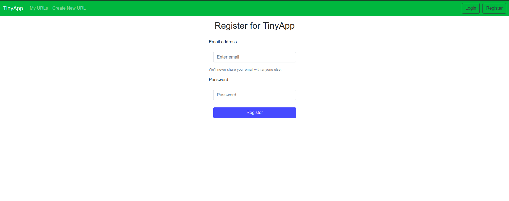

Login to tinyApp

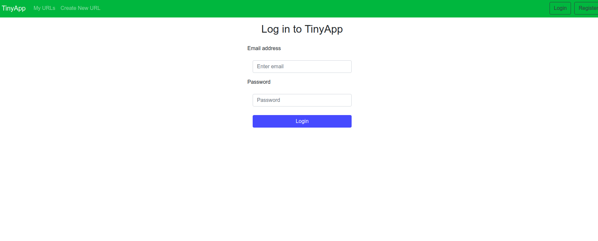

Forget to log in? Don't worry we have you covered with a reminder to!

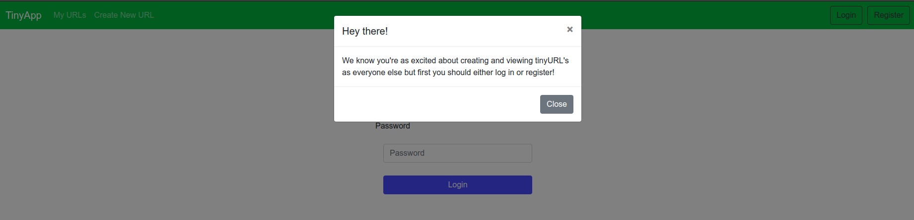

Try to access your content without logging in? We will let you know about that too!

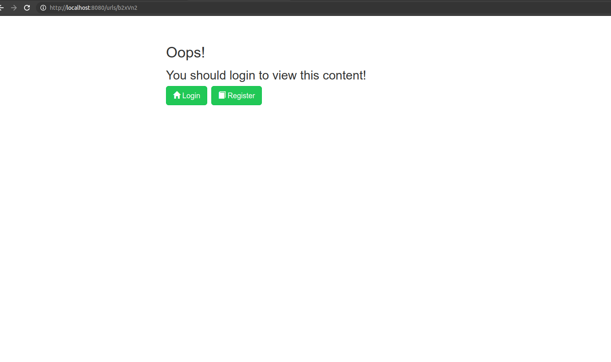

Create URLs
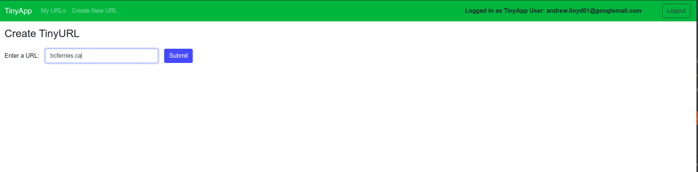

Incomplete Url? 

No worries!

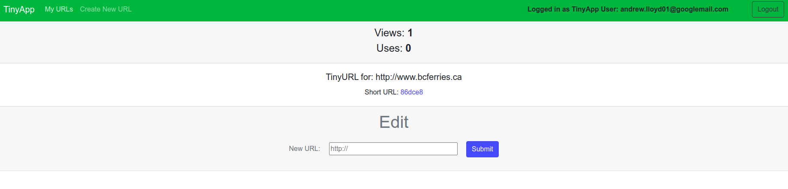

see all of your URLS, how many times they have been used and viewed by other users. 

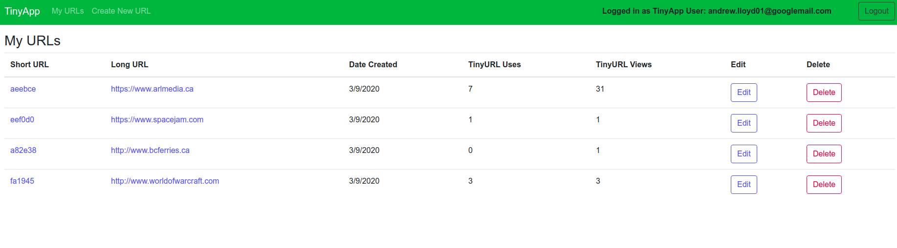

You can optionally edit the associated long url and delete tinyURLs.

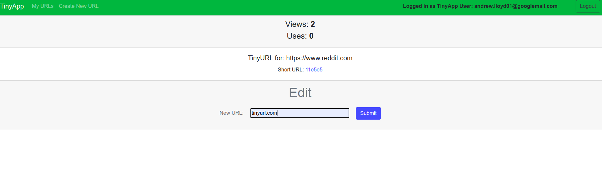

No one can mess with your tinyURLS!

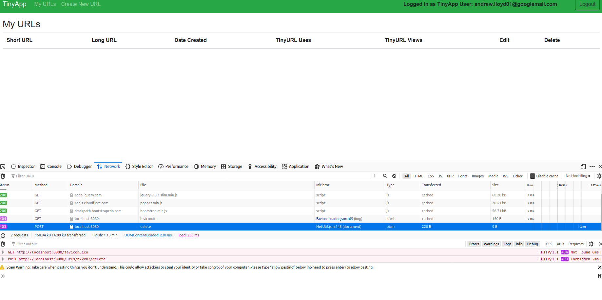

This was a legacy feature that is still in the project, you can optionally turn off forbidding not logged in users to publicly access the urls/tinyURL if you want to encourage users to sign up!

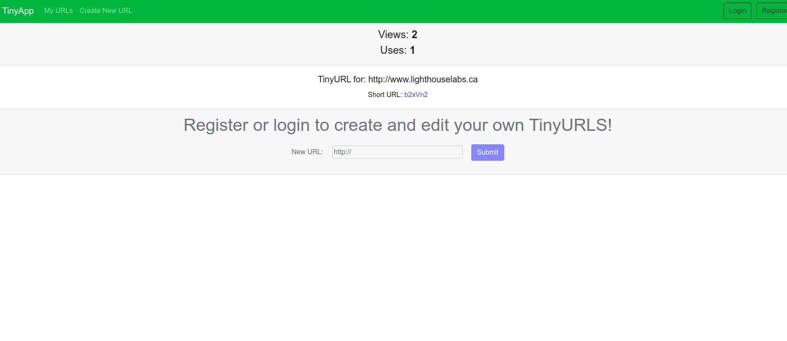

Tracks and shows all individual URLs statistics
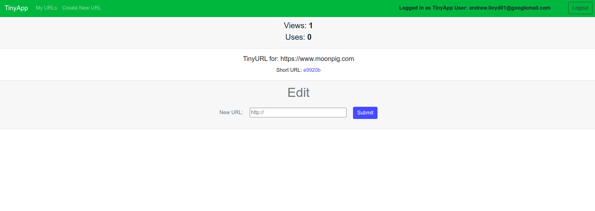

All registered users can access urls.json to see all urls in the database and use the object as a JSON object.

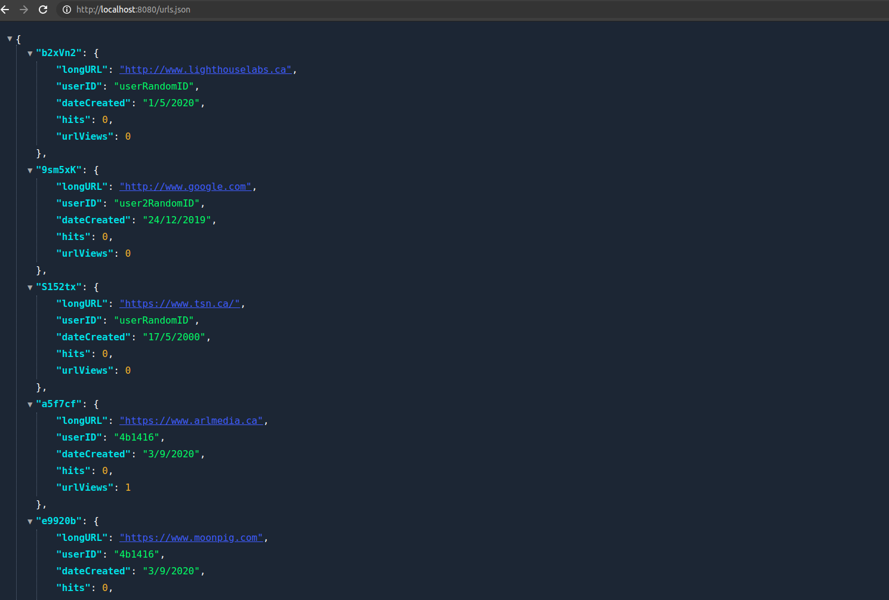

## Dependencies

- Node.js
- Express
- EJS
- bcrypt
- body-parser
- cookie-session

## Getting Started

- Install all dependencies (using the `npm install` command).
- Run the development web server using the `node express_server.js` command.

## Contact

Questions? Comments? Please get in touch via email [andrew.lloyd01@googlemail.com](andrew.lloyd01@googlemail.com).

README: Last updated September 03, 2020